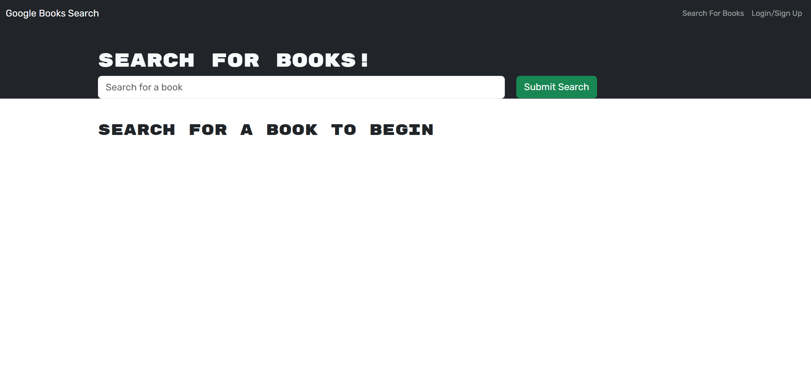
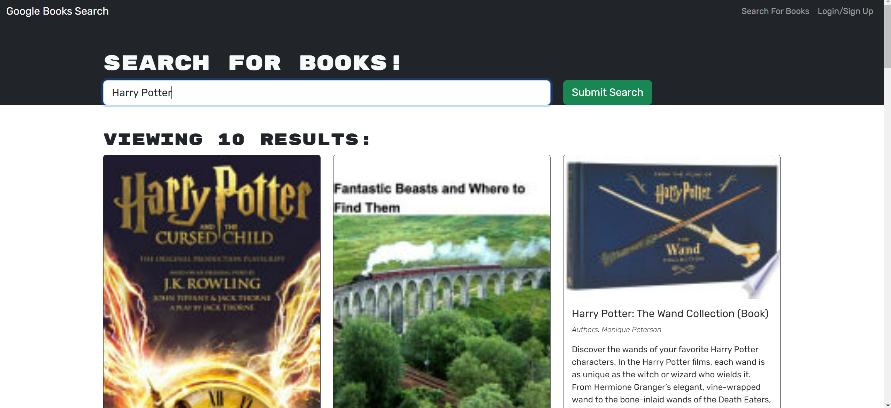
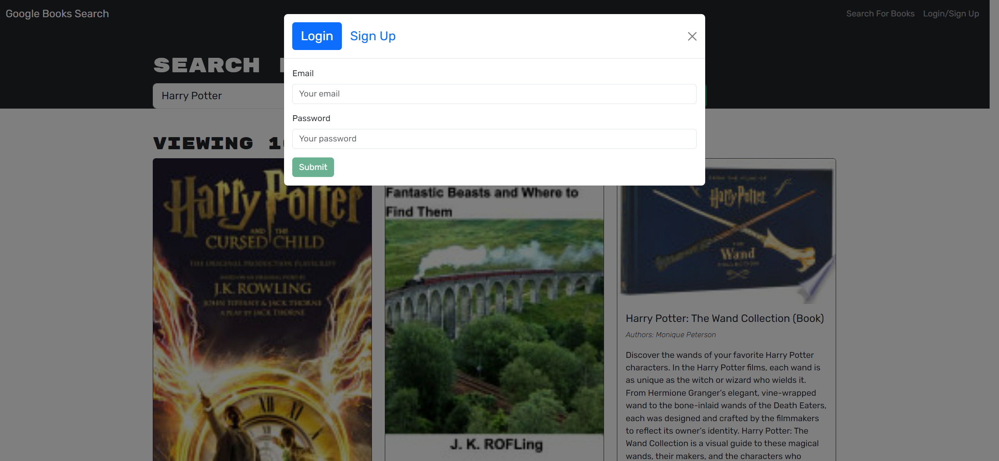

# Book Search Engin

[](https://opensource.org/licenses/MIT)

## Description

This Book Search Engine project was motivated by the desire to create an intuitive and user-friendly platform for avid readers to search and keep track of new books they wish to purchase. 

### Problem Solving

The project solves the problem of searching for books by leveraging the Google Books API and allows users to save their favorite books to their account. 

### Learning

 Through this project, I learned how to integrate GraphQL with a MERN stack application and improve user experience by allowing users to perform various tasks.

## User Story

   AS AN avid reader
    I WANT to search for new books to read
    SO THAT I can keep a list of books to purchase

## Installation

To install and run this project locally, follow these steps:

1. Clone the repository to your local machine.
    
    git clone git@github.com:jodielee062788/book_search_engine.git

2. Open the project folder in your code editor.

3. Install the necessary dependencies by running the command:

    ```npm install```
    
4. Run the application using npm start

    ```npm run develop```
    
## Usage

- Search for Books
When you load the search engine, you'll see a menu with options to search for books and login/signup. Enter a search term in the input field and click the submit button to search for books.

   

- Login/Signup
Click on the login/signup menu option to open a modal where you can either log in or sign up. Provide the required details and click the corresponding button to log in or sign up.

   
   

- Save and View Saved Books
When logged in, you'll have the option to save a book to your account. Click the save button on a book to add it to your saved books list. You can also view your saved books by clicking on the option to see my saved books.

## Live Demo - Render

Check out the live demo of Book Search Engine deployed on Render [here]().

## Credits

Visit my github to see all my works and projects. Feel free to contact me if you have any questions through my email: jodielee062788@gmail.com

## License
This project is licensed under the MIT License - see the [LICENSE](./LICENSE) file for details.


